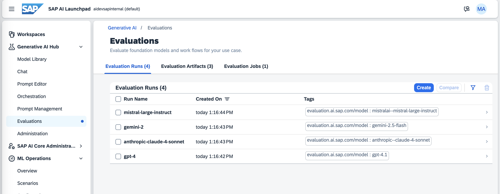

# SAP AICore Evaluations - Benchmarking LLM Models on [Adverse Drug Reactions](https://huggingface.co/datasets/ade-benchmark-corpus/ade_corpus_v2) dataset

This repository contains code and resources for evaluating LLM models in SAP GenAI Hub, against the [ADE-Corpus-V2 Dataset](https://huggingface.co/datasets/ade-benchmark-corpus/ade_corpus_v2) dataset, adopting the tutorials written by [Luca Toldo](https://community.sap.com/t5/user/viewprofilepage/user-id/44202) in the following blog posts:

1. [Benchmarking Generative AI for Drug Safety Using SAP AI Launchpad - Part 1 of 3](https://community.sap.com/t5/artificial-intelligence-and-machine-learning-blogs/benchmarking-generative-ai-for-drug-safety-using-sap-ai-launchpad-part-1-of/ba-p/14126211)
2. [Benchmarking Generative AI for Drug Safety Using SAP AI Launchpad - Part 2 of 3](https://community.sap.com/t5/artificial-intelligence-and-machine-learning-blogs/benchmarking-generative-ai-for-drug-safety-using-sap-ai-launchpad-part-2-of/ba-p/14126525)
3. [Benchmarking Generative AI for Drug Safety Using SAP AI Launchpad - Part 3 of 3](https://community.sap.com/t5/artificial-intelligence-and-machine-learning-blogs/benchmarking-generative-ai-for-drug-safety-using-sap-ai-launchpad-part-3-of/ba-p/14126912)

## Prerequisites

1. (_Optional_) Install [Poetry](https://python-poetry.org/docs/#installation) for Python dependency management.

## Getting Started

1. Clone the repository and change into the project directory:

   ```bash
   git clone https://github.com/anselm94/sap-aicore-evals-adr.git
   cd sap-aicore-evals-adr
   ```

2. Create a virtual environment:

   ```bash
   # use poetry to create a virtual environment
   poetry shell
   ```

   or, if you are not using Poetry:

   ```bash
   python -m venv venv
   source venv/bin/activate  # On Windows use `venv\Scripts\activate`
   ```

3. Install the dependencies:

   ```bash
   # use poetry to install dependencies
   poetry install
   ```

   or, if you are not using Poetry:

   ```bash
   # install dependencies using pip
   pip install -r requirements.txt
   ```

## Steps

### Step 1: Prepare ADE-Corpus-V2 Dataset

1. Start the Jupyter Notebook server:

   ```bash
   jupyter lab
   ```

2. Open the notebook [`notebooks/01_prepare_ade_dataset.ipynb`](./notebooks/01_prepare_ade_dataset.ipynb) and run it to prepare the ADE-Corpus-V2 dataset.

3. Now, the dataset is available for evaluation in [`./evals/data/ade-v2-300.json`](./evals/data/ade-v2-300.json) file.

### Step 2: Prepare S3 Bucket

1. Create an [Object Store](https://discovery-center.cloud.sap/serviceCatalog/object-store) instance in SAP BTP (AWS lansdscape - since the [`02_upload_datasets_into_s3.ipynb`](./notebooks/02_upload_datasets_into_s3.ipynb) notebook is configured to upload the datasets into an S3 bucket).

2. Create a default service key for the created Object Store instance.

   

3. Clone the [`.env.example`](./.env.example) file to `.env`

   ```bash
   cp .env.example .env
   ```

4. Fill in the values with the credentials in [`./.env`](./.env) from the service key created in the previous step.

5. Open the notebook [`notebooks/02_upload_datasets_into_s3.ipynb`](./notebooks/02_upload_datasets_into_s3.ipynb) and run it to upload the prepared dataset into the S3 bucket.

### Step 3: Configure SAP AI Core & Schedule GenAI Evaluations

1. Open the notebook [`notebooks/03_configure_aicore_evals.ipynb`](./notebooks/03_configure_aicore_evals.ipynb)

2. Run through the steps in the notebook to configure SAP AI Core with Object Store credentials, creating a configuration for the GenAI evaluation, and scheduling an execution.

3. Once scheduled, you can monitor the execution status in the 'Executions' tab of 'ML Operations' sections of the SAP AI Core Launchpad or by using the AI Core API to query the execution status.


4. After the execution is completed, you can observe the results in the 'Evaluations' tab of 'Generative AI Hub' section of the SAP AI Core Launchpad.




## License

This project is licensed under the MIT License. See the [LICENSE](LICENSE) file for details.
